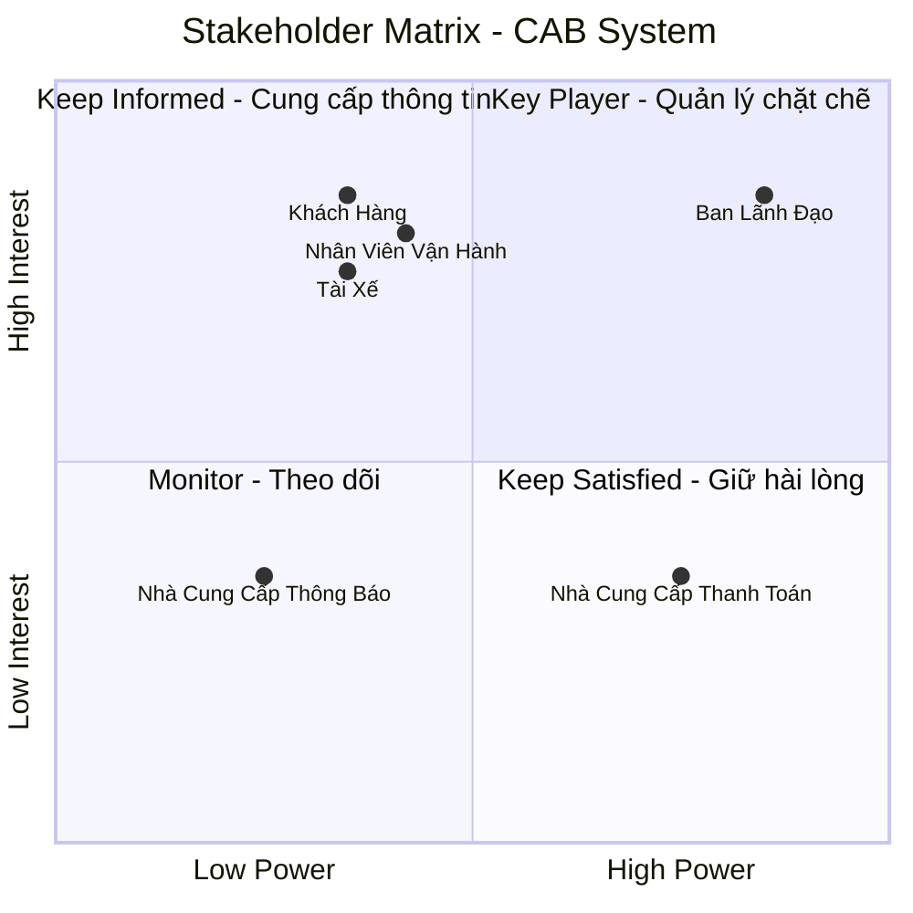
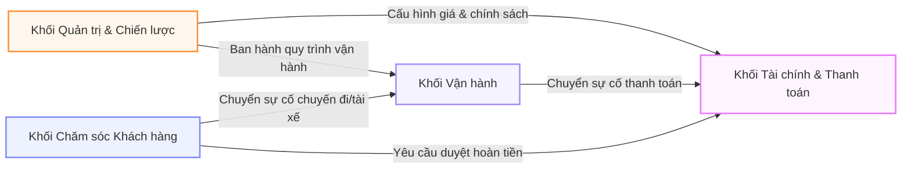
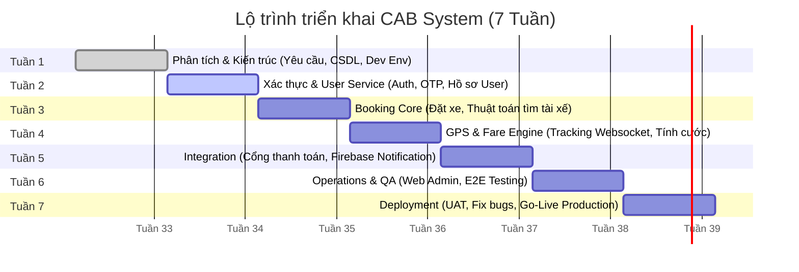

# CAB System - Nền Tảng Đặt Xe Trực Tuyến
1tại sao làm hệ thống này
2 stakeholder : tên, vai trò, tương tác vs hệ thống,
3. stalkholder matrix
4. Xác định phạm vi cần làm cho dự án làm cho hệ thống này hoat động trong vòng 7 tuần
5. Chuyển các yêu cầu thanh yêu cầu về nghiệp vụ (business requirement)
6. Phân rã các yêu cầu chức năng (vd: chức năng tìm tài xế: xác định vị trí kh, tài xế sẵn sàng, tính khoảng cách, chờ tài xế đồng ý) 
7. vẽ usecase diagram
8. đặc tả
9. phân tích quy trình nghiệp vụ 
10. phân tích quy tắc nghiệp vụ (business rules)

---

## 1. Xác Định Yêu Cầu Hệ Thống

### 1.1. Yêu Cầu Kinh Doanh (Business Requirements)

Nền tảng **CAB System** được phát triển nhằm chuyển đổi toàn bộ mô hình vận hành đặt xe của doanh nghiệp ABC từ thủ công sang tự động hóa, giúp quản lý tập trung thông tin thanh toán, phương tiện, khách hàng, tài xế và lịch sử giao dịch trên một hệ thống duy nhất[cite: 1]. Nền tảng hướng tới mục tiêu:
* **Tối ưu hóa điều phối:** Tự động ghép chuyến theo thời gian thực dựa trên vị trí và trạng thái hoạt động của tài xế[cite: 1].
* **Nâng cao trải nghiệm:** Cung cấp thông tin minh bạch, rõ ràng cho khách hàng xuyên suốt hành trình[cite: 1].
* **Phân tích & Quản trị:** Cung cấp hệ thống báo cáo phân tích toàn diện (doanh thu, số lượng chuyến, tỷ lệ hoàn thành/hủy) phục vụ Ban giám đốc ra quyết định[cite: 1].
* **Mở rộng linh hoạt:** Kiến trúc dạng mô-đun chịu tải cao, đảm bảo hoạt động ổn định trong giờ cao điểm và sẵn sàng tích hợp các dịch vụ hay phương thức kinh doanh mới trong tương lai[cite: 1].

---

### 1.2. Yêu Cầu Chức Năng (Functional Requirements)

#### a. Khách hàng (Customer)
* **Tài khoản:** Đăng ký, đăng nhập và cập nhật thông tin cá nhân[cite: 1].
* **Đặt xe:** Nhập điểm đón/đến, chọn loại xe và gửi yêu cầu chuyến đi[cite: 1].
* **Theo dõi hành trình:** Theo dõi trạng thái chuyến đi real-time (tìm tài xế, thông tin tài xế nhận chuyến, thời gian dự kiến đến - ETA, trạng thái di chuyển)[cite: 1].
* **Lịch sử & Cước phí:** Xem lịch sử các chuyến đi và chi tiết số tiền phải trả[cite: 1].
* **Thanh toán:** Thanh toán linh hoạt bằng tiền mặt hoặc thanh toán điện tử; hỗ trợ xử lý lại nếu giao dịch thất bại[cite: 1].
* **Đánh giá:** Gửi đánh giá/phản hồi về tài xế sau khi hoàn thành chuyến đi[cite: 1].

#### b. Tài xế (Driver)
* **Tài khoản & Phương tiện:** Đăng ký tài khoản (hoặc nhờ nhân viên vận hành khởi tạo), cập nhật hồ sơ và thông tin xe[cite: 1].
* **Trạng thái làm việc:** Bật/tắt trạng thái sẵn sàng nhận chuyến[cite: 1].
* **Điều phối chuyến:** Nhận thông báo yêu cầu chuyến đi phù hợp; thực hiện chấp nhận hoặc từ chối chuyến[cite: 1].
* **Cập nhật tiến trình:** Cập nhật trạng thái chuyến đi theo thứ tự: *Đã đến điểm đón* $\rightarrow$ *Đã đón khách* $\rightarrow$ *Đang di chuyển* $\rightarrow$ *Hoàn thành chuyến*[cite: 1].
* **Vị trí địa lý:** Tự động gửi dữ liệu định vị (GPS) theo thời gian thực về hệ thống[cite: 1].

#### c. Thuật toán & Phân công chuyến (Dispatching & Matching)
* Tự động xác định tài xế phù hợp dựa trên vị trí, trạng thái sẵn sàng và các tiêu chí vận hành[cite: 1].
* Tự động chuyển giao yêu cầu cho tài xế tiếp theo nếu tài xế đầu tiên từ chối hoặc không phản hồi mà không bắt khách hàng thao tác lại[cite: 1].
* Thông báo rõ ràng cho khách hàng trong trường hợp không tìm thấy tài xế phù hợp[cite: 1].

#### d. Tính cước & Thanh toán (Pricing & Payment)
* Tự động tính toán tổng cước phí sau khi hoàn thành chuyến đi dựa trên dịch vụ và thông tin hành trình[cite: 1].
* Tích hợp cổng thanh toán điện tử bên ngoài để xử lý các giao dịch trực tuyến an toàn[cite: 1].

#### e. Quản trị & Vận hành (Operations & Management)
* **Giao diện Admin:** Cho phép nhân viên vận hành quản lý dữ liệu khách hàng, tài xế, phương tiện và danh sách chuyến đi[cite: 1].
* **Giám sát & Hỗ trợ:** Xem danh sách chuyến đi đang diễn ra, kiểm tra trạng thái tài xế và hỗ trợ xử lý chuyến lỗi/sự cố[cite: 1].
* **Phân quyền & Kiểm soát:** Tra cứu lịch sử giao dịch và phân quyền người dùng (giới hạn thao tác nhạy cảm đối với nhân viên thông thường)[cite: 1].
* **Báo cáo thống kê:** Xuất báo cáo chi tiết cho Ban lãnh đạo về tổng số chuyến, doanh thu, tỷ lệ hoàn thành/hủy, hiệu suất tài xế[cite: 1].

#### f. Thông báo (Notifications)
* **Khách hàng:** Nhận thông báo tiếp nhận yêu cầu, tài xế nhận chuyến, tài xế đến điểm đón, hoàn thành chuyến và kết quả thanh toán[cite: 1].
* **Tài xế:** Nhận thông báo chuyến mới hoặc các thay đổi liên quan đến chuyến đang thực hiện[cite: 1].

---

### 1.3. Yêu Cầu Phi Chức Năng (Non-Functional Requirements)

| Nhóm yêu cầu | Chi tiết yêu cầu |
| :--- | :--- |
| **Hiệu năng & Mở rộng** | • Hệ thống vận hành ổn định, chịu tải tốt trong giờ cao điểm. • Kiến trúc dạng mô-đun cho phép mở rộng độc lập từng thành phần khi tải tăng[cite: 1]. |
| **Độ tin cậy & Sẵn sàng**| • Khả năng cách ly sự cố (lỗi ở mô-đun thanh toán/thông báo không ngưng trệ việc đặt xe). • Triển khai cập nhật tính năng mới từng phần, hạn chế tối đa gián đoạn hệ thống[cite: 1]. |
| **Bảo mật (Security)** | • Bắt buộc xác thực tài khoản trước khi truy cập tính năng cá nhân. • Phân quyền truy cập nghiêm ngặt cho các thao tác quản trị. • Bảo vệ an toàn dữ liệu cá nhân, thông tin phương tiện, vị trí và giao dịch. • **Không lưu trực tiếp** thông tin thẻ/tài khoản thanh toán nhạy cảm trên nền tảng[cite: 1]. |
| **Tính kiểm toán** | • Lưu vết nhật ký (logs) đầy đủ đối với các thao tác quan trọng để tra cứu khi có sự cố[cite: 1]. |
| **Tính linh hoạt** | • Kiến trúc linh hoạt, dễ dàng tích hợp thêm cổng thanh toán, kênh thông báo hoặc dịch vụ mới mà không cần tái cấu trúc toàn bộ ứng dụng[cite: 1]. |

---

## 2. Các Tác Nhân Của Hệ Thống (System Actors)

| Tác nhân | Loại | Mô tả vai trò |
| :--- | :--- | :--- |
| **Khách hàng** *(Customer)* | Human | Người dùng cuối đăng ký/đăng nhập, tạo yêu cầu đặt xe, theo dõi hành trình, thanh toán, xem lịch sử và đánh giá chất lượng tài xế[cite: 1]. |
| **Tài xế** *(Driver)* | Human | Người điều khiển phương tiện, cập nhật thông tin xe/hồ sơ, bật/tắt trạng thái nhận chuyến, tiếp nhận chuyến và cập nhật tiến trình chuyến đi real-time[cite: 1]. |
| **Nhân viên vận hành** *(Operations Staff)* | Human | Sử dụng giao diện Admin để quản lý dữ liệu hệ thống, tạo tài khoản tài xế, giám sát chuyến đi, xử lý sự cố và tra cứu giao dịch[cite: 1]. |
| **Ban giám đốc** *(Management)* | Human | Theo dõi hệ thống báo cáo thống kê (doanh thu, tỷ lệ hoàn thành/hủy, hiệu suất) để quản trị và đưa ra định hướng chiến lược[cite: 1]. |
| **Nhà cung cấp thanh toán** *(External Payment Provider)* | External System | Hệ thống bên thứ ba xử lý giao dịch thanh toán điện tử an toàn, giúp loại bỏ việc lưu trữ dữ liệu thẻ nhạy cảm trên CAB System[cite: 1]. |
| **Nhà cung cấp thông báo** *(External Notification Provider)* | External System | Hệ thống bên thứ ba đảm nhận việc truyền tải thông báo (SMS, Push Notification, Email) đến khách hàng và tài xế[cite: 1]. |
3.	Stalkholder
## Các Bên Liên Quan (Stakeholders)

| Stakeholder | Vai Trò |
| :--- | :--- |
| **Ban giám đốc** | Nhóm định hướng chiến lược, đưa ra các kỳ vọng kinh doanh, theo dõi báo cáo thống kê (doanh thu, số chuyến, hiệu quả hoạt động) và quyết định phê duyệt dự án. |
| **Khách hàng** | Người dùng cuối trực tiếp đặt xe, chọn loại dịch vụ, theo dõi hành trình, thực hiện thanh toán, xem lịch sử chuyến đi và đánh giá chất lượng dịch vụ của tài xế. |
| **Tài xế** | Người trực tiếp cung cấp dịch vụ vận chuyển, cập nhật thông tin hồ sơ/phương tiện, bật/tắt trạng thái làm việc, nhận/từ chối chuyến và cập nhật tiến trình chuyến đi theo thời gian thực. |
| **Nhân viên vận hành** | Nhóm quản trị hệ thống hàng ngày, thực hiện tạo tài khoản cho tài xế, kiểm tra trạng thái hoạt động, hỗ trợ xử lý sự cố/chuyến lỗi và tra cứu thông tin giao dịch. |
| **Chuyên viên phân tích nghiệp vụ** | Người đóng vai trò cầu nối, chịu trách nhiệm làm rõ các yêu cầu chưa chốt (cách tính cước, tiêu chí phân công, chính sách hủy chuyến...) với các bên liên quan và xác định phạm vi, quy trình nghiệp vụ cho đội ngũ phát triển. |
| **Đội ngũ phát triển** | Nhóm kỹ thuật chịu trách nhiệm thiết kế kiến trúc linh hoạt, xây dựng và triển khai sản phẩm CAB System theo đúng các yêu cầu nghiệp vụ và kỹ thuật. |

| **Nhà cung cấp thanh toán bên ngoài** | Đối tác bên thứ ba chịu trách nhiệm tiếp nhận và xử lý bảo mật các giao dịch thanh toán điện tử cho khách hàng. |
| **Nhà cung cấp dịch vụ thông báo** | Đối tác bên thứ ba hỗ trợ chuyển tải thông báo (SMS, Push Notification...) đến khách hàng và tài xế qua các kênh hạ tầng. |

## 4. Ma Trận Stakeholder Metrix 

## 4. Đơn Vị Nghiệp Vụ (Business Units) & Vai Trò Trong Hệ Thống

| Business Unit | Chức năng chính | Phạm vi Dữ liệu & Công cụ | Stakeholders liên quan |
| :--- | :--- | :--- | :--- |
| **Khối Vận hành** *(Operations)* | • Giám sát & điều phối chuyến đi thời gian thực. • Quản lý danh sách, hồ sơ & trạng thái tài xế. • Xử lý các sự cố phát sinh trên đường. | • Live Map Dashboard. • Quản lý Chuyến đi, Tài xế, Định vị GPS. | Nhân viên vận hành, Tài xế |
| **Khối Tài chính & Thanh toán** *(Finance & Billing)* | • Quản lý dòng tiền, tích hợp cổng thanh toán. • Cấu hình bảng cước phí, tỷ lệ chiết khấu. • Đối soát giao dịch & thanh toán cho tài xế. | • Bảng cấu hình Cước phí (Pricing Policy). • Lịch sử giao dịch, Hóa đơn, Ví tài xế. | Ban lãnh đạo, Nhà cung cấp thanh toán, Tài xế |
| **Khối Chăm sóc Khách hàng** *(Customer Support - CS)* | • Tiếp nhận & xử lý khiếu nại của khách hàng/tài xế. • Xử lý yêu cầu hoàn tiền, đền bù chuyến đi. • Quản lý hệ thống đánh giá & phản hồi. | • Hệ thống Quản lý Ticket (CS Portal). • Lịch sử khiếu nại, Đánh giá (Rating/Review). | Khách hàng, Tài xế |
| **Khối Quản trị & Chiến lược** *(Executive Management)* | • Theo dõi chỉ số tăng trưởng & báo cáo BI. • Phê duyệt chính sách giá, khuyến mãi, ngân sách. • Cấu hình các tham số vận hành toàn hệ thống. | • Executive Dashboard (Revenue, Growth). • System Configuration, Audit Logs. | Ban lãnh đạo |

---

### 4.4. Sơ Đồ Tương Tác Giữa Các Business Units

## 5. Phạm Vi Dự Án & Lộ Trình Triển Khai 7 Tuần (MVP Scope & Roadmap)

Để đưa **CAB System** vào hoạt động thực tế đúng hạn trong **7 tuần**, dự án áp dụng chiến lược **MVP (Minimum Viable Product)**: tập trung xây dựng luồng nghiệp vụ cốt lõi (Đặt xe - Ghép chuyến - Theo dõi - Thanh toán) và hoãn lại các tính năng nâng cao sang giai đoạn 2.

---

### 5.1. Bảng Tóm Tắt Phạm Vi (In-Scope vs. Out-of-Scope)

| Hạng mục | Trong phạm vi MVP (7 tuần) | Giai đoạn 2 (Out-of-Scope) |
| :--- | :--- | :--- |
| **Đặt xe & Ghép chuyến** | • Đặt xe tức thì (Book now). • Tìm & phân công tài xế gần nhất (bán kính cố định). | • Đặt xe theo lịch (Schedule ride). • Đi chung xe (Ride sharing / Pooling). |
| **Định vị & Theo dõi** | • Cập nhật vị trí GPS tài xế thời gian thực. • Tính quãng đường & thời gian dự kiến (Google Maps API). | • Tối ưu hóa lộ trình đa điểm dừng (Multi-stop). • Cảnh báo lệch tuyến thông minh. |
| **Tính cước & Thanh toán** | • Bảng giá cố định theo km + thời gian chờ. • Tích hợp 01 cổng thanh toán điện tử (VNPay/Momo) + Tiền mặt. | • Thuật toán tăng giá theo cầu (Surge Pricing). • Mã giảm giá/Khuyến mãi phức tạp. |
| **Quản trị & Vận hành** | • Admin Dashboard: Quản lý Tài xế, Khách hàng, Chuyến đi. • Tra cứu lịch sử & xử lý sự cố cơ bản. | • Hệ thống BI/Analytics chuyên sâu. • Tự động hóa đối soát tài chính nâng cao. |
| **Thông báo & Đánh giá** | • Gửi Push Notification (Firebase) & SMS OTP. • Đánh giá sao (1-5★) + nhận xét ngắn sau chuyến. | • Chương trình Khách hàng thân thiết (Loyalty Point). • Chat trực tiếp trong ứng dụng (In-app Chat). |

---

### 5.2. Lộ Trình Triển Khai Chi Tiết Trong 7 Tuần (7-Week Roadmap)

## 6. Yêu Cầu Nghiệp Vụ (Business Requirements - BRD)

---

### 6.1. Nhóm Yêu Cầu: Đặt Xe & Điều Phối Chuyến Đi (Booking & Matching)

| Mã BR | Tên Yêu Cầu Nghiệp Vụ | Mô Tả Nghiệp Vụ & Quy Tắc Kinh Doanh | Mục Tiêu Kinh Doanh / KPI |
| :--- | :--- | :--- | :--- |
| **BR-BOOK-01** | **Tạo yêu cầu đặt xe tức thì** | • Khách hàng chọn điểm đi, điểm đến và xem trước giá cước trị giá cố định trước khi xác nhận. • Hệ thống chỉ cho phép tạo chuyến nếu khách hàng không có chuyến đi nào đang dở dang. | Tối ưu trải nghiệm đặt xe, tỉ lệ hoàn tất thao tác đặt xe trong **< 15 giây**. |
| **BR-BOOK-02** | **Tự động ghép chuyến theo bán kính** | • Hệ thống tự động quét và gửi thông báo mời nhận chuyến cho tài xế rảnh gần nhất trong bán kính $R$ (mặc định 3km). • Nếu tài xế từ chối hoặc quá 15 giây không phản hồi, tự động chuyển sang tài xế tiếp theo. | Đạt tỉ lệ ghép chuyến thành công **> 85%** trong lần quét đầu tiên; thời gian chờ tài xế **< 30 giây**. |
| **BR-BOOK-03** | **Quản lý vòng đời chuyến đi** | • Chuyến đi trải qua các trạng thái bắt buộc: *Đã đặt $\rightarrow$ Tài xế nhận $\rightarrow$ Đã đến điểm đón $\rightarrow$ Đang di chuyển $\rightarrow$ Hoàn thành (hoặc Hủy)*. • Cho phép hủy chuyến miễn phí trong 2 phút đầu sau khi tài xế nhận chuyến. | Minh bạch luồng vận hành, giảm tỉ lệ tranh chấp hủy chuyến dưới **5%**. |

---

### 6.2. Nhóm Yêu Cầu: Giá Cước & Thanh Toán (Pricing & Settlement)

| Mã BR | Tên Yêu Cầu Nghiệp Vụ | Mô Tả Nghiệp Vụ & Quy Tắc Kinh Doanh | Mục Tiêu Kinh Doanh / KPI |
| :--- | :--- | :--- | :--- |
| **BR-FIN-01** | **Tính cước phí tự động** | • Công thức tính cước: `Tổng giá = Giá mở cửa + (Số km x Đơn giá/km) + Phí chờ` (nếu có). • Bảng giá có thể điều chỉnh linh hoạt theo khung giờ (Giờ cao điểm / Giờ đêm) bởi Khối Vận hành. | Đảm bảo tính cước chính xác 100%, không xảy ra sai lệch giữa ứng dụng và máy chủ. |
| **BR-FIN-02** | **Hỗ trợ đa dạng thanh toán** | • Hỗ trợ 2 hình thức: **Tiền mặt** và **Thanh toán điện tử** (Cổng VNPay/MoMo). • Với thanh toán điện tử, hệ thống giữ tiền (Hold/Pre-auth) hoặc thu tiền ngay khi hoàn thành chuyến đi. | Giảm tỷ lệ giao dịch thất bại xuống **< 1%**; đối soát dòng tiền chính xác trong ngày (T+0). |
| **BR-FIN-03** | **Tự động trích xuất hoa hồng tài xế** | • Hệ thống tự động khấu trừ % chiết khấu (ví dụ: 20%) trên mỗi chuyến đi hoàn thành vào Ví điện tử của Tài xế. • Tài xế phải duy trì số dư tối thiểu trong ví để tiếp tục nhận chuyến. | Tự động hóa đối soát tài chính, loại bỏ 100% công đoạn tính toán thủ công. |

---

### 6.3. Nhóm Yêu Cầu: Giám Sát Hành Trình & An Toàn (Tracking & Safety)

| Mã BR | Tên Yêu Cầu Nghiệp Vụ | Mô Tả Nghiệp Vụ & Quy Tắc Kinh Doanh | Mục Tiêu Kinh Doanh / KPI |
| :--- | :--- | :--- | :--- |
| **BR-TRK-01** | **Theo dõi vị trí thời gian thực** | • Khách hàng và Khối Vận hành theo dõi được vị trí di chuyển thực tế của tài xế trên bản đồ với độ trễ tối đa 3-5 giây. • Tự động tính toán lại thời gian dự kiến đến (ETA). | Tăng mức độ an tâm cho khách hàng; độ chính xác định vị sai số **< 10m**. |
| **BR-TRK-02** | **Cảnh báo và xử lý sự cố khẩn cấp** | • Cung cấp nút hỗ trợ khẩn cấp / báo sự cố trên ứng dụng cho cả Khách hàng và Tài xế. • Tự động bắn cảnh báo ưu tiên cao về màn hình giám sát của Khối Vận hành. | Thời gian phản hồi sự cố khẩn cấp của bộ phận Vận hành **< 3 phút**. |

---

### 6.4. Nhóm Yêu Cầu: Đánh Giá & Vận Hành Khách Hàng (Customer Experience & Ops)

| Mã BR | Tên Yêu Cầu Nghiệp Vụ | Mô Tả Nghiệp Vụ & Quy Tắc Kinh Doanh | Mục Tiêu Kinh Doanh / KPI |
| :--- | :--- | :--- | :--- |
| **BR-OPS-01** | **Duyệt hồ sơ & Quản lý đối tác tài xế** | • Tài xế chỉ được phép bật chế độ "Sẵn sàng nhận chuyến" sau khi bộ phận Vận hành thẩm định và duyệt đầy đủ: *Bằng lái, Căn cước, Đăng ký xe, Bảo hiểm*. • Tự động khóa tài khoản nếu tài xế bị đánh giá dưới 3.0★. | Đảm bảo 100% tài xế lưu thông trên hệ thống hợp pháp và đạt chuẩn chất lượng. |
| **BR-OPS-02** | **Đánh giá và Tiếp nhận phản hồi** | • Cho phép khách hàng chấm điểm (1-5 sao) và chọn lý do phản hồi sau khi kết thúc chuyến. • Tự động tạo ticket xử lý cho CS khi nhận đánh giá 1-2 sao hoặc có phản ánh thái độ/phụ phí. | Duy trì điểm hài lòng trung bình của dịch vụ (CSAT) **$\ge$ 4.5/5.0★**. |

---

## 7. Phân Rã Chi Tiết Yêu Cầu Chức Năng (Functional Requirements Breakdown)

---

## 📑 Danh Sách Chức Năng Hệ Thống (Feature Matrix)

Bảng tổng hợp chi tiết toàn bộ các chức năng hệ thống được trích xuất từ các **Yêu Cầu Nghiệp Vụ (BRD)**:

| Nhóm Nghiệp Vụ | Mã BR | Danh Sách Chức Năng Hệ Thống (Features) |
| :--- | :--- | :--- |
| **1. Đặt Xe & Ghép Chuyến** *(Booking & Matching)* | **BR-BOOK-01** | • **Định vị & Chọn địa điểm:** Tự động lấy tọa độ hiện tại, tìm kiếm và ghim điểm đón/trả. • **Kiểm tra trạng thái người dùng:** Chặn đặt xe mới nếu đang có chuyến đi chưa hoàn thành. • **Xem trước cước phí & Lộ trình (Upfront Pricing):** Hiển thị cước phí cố định và thời gian di chuyển dự kiến (ETA) trước khi xác nhận. • **Khởi tạo chuyến đi:** Tạo bản ghi chuyến đi ở trạng thái chờ (`PENDING`). |
| | **BR-BOOK-02** | • **Quét vị trí tài xế:** Tự động định vị và lọc danh sách tài xế rảnh (`AVAILABLE`) trong bán kính quy định (3km). • **Thuật toán phân công tài xế:** Tự động sắp xếp và gửi thông báo mời nhận chuyến tới tài xế tối ưu nhất. • **Quản lý đếm ngược & Chuyển chuyến:** Hiển thị màn hình chờ nhận chuyến 15s cho tài xế; tự động chuyển sang tài xế khác nếu bị từ chối hoặc hết giờ. • **Xử lý ghép chuyến thất bại:** Tự động mở rộng bán kính quét hoặc thông báo không tìm thấy xe. |
| | **BR-BOOK-03** | • **Quản lý trạng thái chuyến đi (State Machine):** Chuyển đổi và kiểm soát chặt chẽ các trạng thái (*Đã đặt $\rightarrow$ Nhận chuyến $\rightarrow$ Đến điểm đón $\rightarrow$ Đang di chuyển $\rightarrow$ Hoàn thành*). • **Hủy chuyến đi & Tính phí phạt:** Cho phép hủy chuyến miễn phí (trong 2 phút đầu) và tự động áp dụng phí phạt hủy chuyến muộn. |
| **2. Giá Cước & Thanh Toán** *(Pricing & Settlement)* | **BR-FIN-01** | • **Tính cước phí tự động:** Tính toán tổng tiền theo công thức (Giá mở cửa + Số km $\times$ Đơn giá + Phí chờ). • **Cấu hình bảng giá linh hoạt:** Cho phép quản trị viên điều chỉnh đơn giá theo khung giờ (Giờ cao điểm / Đêm). • **Tính lại cước phí khi đổi lộ trình:** Tự động điều chỉnh giá tiền dựa trên số km thực tế khi kết thúc chuyến nếu đi sai lộ trình ban đầu. |
| | **BR-FIN-02** | • **Thanh toán tiền mặt:** Hiển thị số tiền phải thu cho tài xế và ghi nhận xác nhận thu tiền. • **Thanh toán qua cổng điện tử (VNPay/MoMo):** Tự động giữ tiền (Hold/Pre-auth) khi đặt xe và trừ tiền thực tế (Capture) khi kết thúc chuyến. • **Xử lý lỗi thanh toán:** Tự động chuyển đổi hình thức thanh toán sang tiền mặt khi cổng thanh toán gặp sự cố. |
| | **BR-FIN-03** | • **Trích xuất hoa hồng tự động:** Khấu trừ trực tiếp % chiết khấu hệ thống vào Ví điện tử của tài xế sau mỗi chuyến đi. • **Kiểm soát hạn mức ví tài xế:** Tự động khóa quyền nhận chuyến nếu số dư ví của tài xế xuống dưới mức tối thiểu. |
| **3. Giám Sát & An Toàn** *(Tracking & Safety)* | **BR-TRK-01** | • **Định vị GPS Realtime:** Thu thập và truyền tọa độ tài xế thời gian thực ($3-5\text{s}/lần$) qua kết nối WebSocket/MQTT. • **Hiển thị bản đồ hành trình:** Cho phép Khách hàng và Khối Vận hành theo dõi vị trí xe di chuyển trên bản đồ. • **Tự động cập nhật ETA:** Tính toán lại thời gian đến dự kiến dựa trên tốc độ thực tế. |
| | **BR-TRK-02** | • **Nút báo động khẩn cấp (SOS):** Cung cấp nút hỗ trợ khẩn cấp trên màn hình ứng dụng Khách hàng và Tài xế. • **Cảnh báo sự cố ưu tiên:** Nổi cảnh báo đỏ/âm thanh trên màn hình giám sát của Vận hành và tự động gửi SMS vị trí tới số điện thoại người thân. |
| **4. Đánh Giá & Vận Hành** *(Ops & Support)* | **BR-OPS-01** | • **Đăng ký & Tải hồ sơ tài xế:** Tiếp nhận ảnh chụp Căn cước, Bằng lái, Đăng ký xe, Bảo hiểm. • **Thẩm định & Duyệt hồ sơ (Admin Portal):** Cho phép nhân viên Vận hành kiểm tra và duyệt hồ sơ trước khi kích hoạt tài khoản tài xế. • **Tự động khóa tài khoản kém chất lượng:** Chạy tiến trình tự động khóa tài khoản nếu điểm đánh giá trung bình của tài xế rơi xuống dưới $3.0\star$. |
| | **BR-OPS-02** | • **Đánh giá & Chấm điểm (Rating):** Popup chấm điểm $1-5\star$, chọn lý do nhanh hoặc nhập phản hồi sau chuyến đi. • **Tính điểm trung bình tích lũy:** Cập nhật điểm uy tín trung bình của tài xế tức thì. • **Tự động tạo Ticket CSKH:** Khởi tạo yêu cầu hỗ trợ (Ticket) gán độ ưu tiên cao tới bộ phận CSKH khi nhận đánh giá $1-2\star$. |
