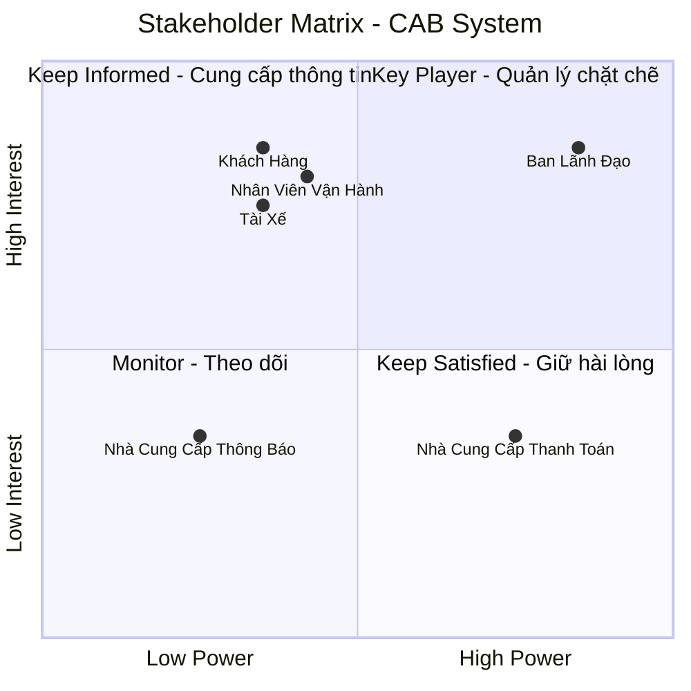
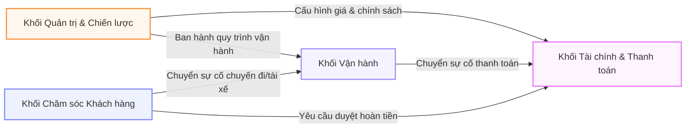

# CAB System - Nền Tảng Đặt Xe Trực Tuyến

---

## 1. Xác Định Yêu Cầu Hệ Thống

### 1.1. Yêu Cầu Kinh Doanh (Business Requirements)

Nền tảng **CAB System** được phát triển nhằm chuyển đổi toàn bộ mô hình vận hành đặt xe của doanh nghiệp ABC từ thủ công sang tự động hóa, giúp quản lý tập trung thông tin thanh toán, phương tiện, khách hàng, tài xế và lịch sử giao dịch trên một hệ thống duy nhất[cite: 1]. Nền tảng hướng tới mục tiêu:
* **Tối ưu hóa điều phối:** Tự động ghép chuyến theo thời gian thực dựa trên vị trí và trạng thái hoạt động của tài xế[cite: 1].
* **Nâng cao trải nghiệm:** Cung cấp thông tin minh bạch, rõ ràng cho khách hàng xuyên suốt hành trình[cite: 1].
* **Phân tích & Quản trị:** Cung cấp hệ thống báo cáo phân tích toàn diện (doanh thu, số lượng chuyến, tỷ lệ hoàn thành/hủy) phục vụ Ban giám đốc ra quyết định[cite: 1].
* **Mở rộng linh hoạt:** Kiến trúc dạng mô-đun chịu tải cao, đảm bảo hoạt động ổn định trong giờ cao điểm và sẵn sàng tích hợp các dịch vụ hay phương thức kinh doanh mới trong tương lai[cite: 1].

---

### 1.2. Yêu Cầu Chức Năng (Functional Requirements)

#### a. Khách hàng (Customer)
* **Tài khoản:** Đăng ký, đăng nhập và cập nhật thông tin cá nhân[cite: 1].
* **Đặt xe:** Nhập điểm đón/đến, chọn loại xe và gửi yêu cầu chuyến đi[cite: 1].
* **Theo dõi hành trình:** Theo dõi trạng thái chuyến đi real-time (tìm tài xế, thông tin tài xế nhận chuyến, thời gian dự kiến đến - ETA, trạng thái di chuyển)[cite: 1].
* **Lịch sử & Cước phí:** Xem lịch sử các chuyến đi và chi tiết số tiền phải trả[cite: 1].
* **Thanh toán:** Thanh toán linh hoạt bằng tiền mặt hoặc thanh toán điện tử; hỗ trợ xử lý lại nếu giao dịch thất bại[cite: 1].
* **Đánh giá:** Gửi đánh giá/phản hồi về tài xế sau khi hoàn thành chuyến đi[cite: 1].

#### b. Tài xế (Driver)
* **Tài khoản & Phương tiện:** Đăng ký tài khoản (hoặc nhờ nhân viên vận hành khởi tạo), cập nhật hồ sơ và thông tin xe[cite: 1].
* **Trạng thái làm việc:** Bật/tắt trạng thái sẵn sàng nhận chuyến[cite: 1].
* **Điều phối chuyến:** Nhận thông báo yêu cầu chuyến đi phù hợp; thực hiện chấp nhận hoặc từ chối chuyến[cite: 1].
* **Cập nhật tiến trình:** Cập nhật trạng thái chuyến đi theo thứ tự: *Đã đến điểm đón* $\rightarrow$ *Đã đón khách* $\rightarrow$ *Đang di chuyển* $\rightarrow$ *Hoàn thành chuyến*[cite: 1].
* **Vị trí địa lý:** Tự động gửi dữ liệu định vị (GPS) theo thời gian thực về hệ thống[cite: 1].

#### c. Thuật toán & Phân công chuyến (Dispatching & Matching)
* Tự động xác định tài xế phù hợp dựa trên vị trí, trạng thái sẵn sàng và các tiêu chí vận hành[cite: 1].
* Tự động chuyển giao yêu cầu cho tài xế tiếp theo nếu tài xế đầu tiên từ chối hoặc không phản hồi mà không bắt khách hàng thao tác lại[cite: 1].
* Thông báo rõ ràng cho khách hàng trong trường hợp không tìm thấy tài xế phù hợp[cite: 1].

#### d. Tính cước & Thanh toán (Pricing & Payment)
* Tự động tính toán tổng cước phí sau khi hoàn thành chuyến đi dựa trên dịch vụ và thông tin hành trình[cite: 1].
* Tích hợp cổng thanh toán điện tử bên ngoài để xử lý các giao dịch trực tuyến an toàn[cite: 1].

#### e. Quản trị & Vận hành (Operations & Management)
* **Giao diện Admin:** Cho phép nhân viên vận hành quản lý dữ liệu khách hàng, tài xế, phương tiện và danh sách chuyến đi[cite: 1].
* **Giám sát & Hỗ trợ:** Xem danh sách chuyến đi đang diễn ra, kiểm tra trạng thái tài xế và hỗ trợ xử lý chuyến lỗi/sự cố[cite: 1].
* **Phân quyền & Kiểm soát:** Tra cứu lịch sử giao dịch và phân quyền người dùng (giới hạn thao tác nhạy cảm đối với nhân viên thông thường)[cite: 1].
* **Báo cáo thống kê:** Xuất báo cáo chi tiết cho Ban lãnh đạo về tổng số chuyến, doanh thu, tỷ lệ hoàn thành/hủy, hiệu suất tài xế[cite: 1].

#### f. Thông báo (Notifications)
* **Khách hàng:** Nhận thông báo tiếp nhận yêu cầu, tài xế nhận chuyến, tài xế đến điểm đón, hoàn thành chuyến và kết quả thanh toán[cite: 1].
* **Tài xế:** Nhận thông báo chuyến mới hoặc các thay đổi liên quan đến chuyến đang thực hiện[cite: 1].

---

### 1.3. Yêu Cầu Phi Chức Năng (Non-Functional Requirements)

| Nhóm yêu cầu | Chi tiết yêu cầu |
| :--- | :--- |
| **Hiệu năng & Mở rộng** | • Hệ thống vận hành ổn định, chịu tải tốt trong giờ cao điểm.<br>• Kiến trúc dạng mô-đun cho phép mở rộng độc lập từng thành phần khi tải tăng[cite: 1]. |
| **Độ tin cậy & Sẵn sàng**| • Khả năng cách ly sự cố (lỗi ở mô-đun thanh toán/thông báo không ngưng trệ việc đặt xe).<br>• Triển khai cập nhật tính năng mới từng phần, hạn chế tối đa gián đoạn hệ thống[cite: 1]. |
| **Bảo mật (Security)** | • Bắt buộc xác thực tài khoản trước khi truy cập tính năng cá nhân.<br>• Phân quyền truy cập nghiêm ngặt cho các thao tác quản trị.<br>• Bảo vệ an toàn dữ liệu cá nhân, thông tin phương tiện, vị trí và giao dịch.<br>• **Không lưu trực tiếp** thông tin thẻ/tài khoản thanh toán nhạy cảm trên nền tảng[cite: 1]. |
| **Tính kiểm toán** | • Lưu vết nhật ký (logs) đầy đủ đối với các thao tác quan trọng để tra cứu khi có sự cố[cite: 1]. |
| **Tính linh hoạt** | • Kiến trúc linh hoạt, dễ dàng tích hợp thêm cổng thanh toán, kênh thông báo hoặc dịch vụ mới mà không cần tái cấu trúc toàn bộ ứng dụng[cite: 1]. |

---

## 2. Các Tác Nhân Của Hệ Thống (System Actors)

| Tác nhân | Loại | Mô tả vai trò |
| :--- | :--- | :--- |
| **Khách hàng** *(Customer)* | Human | Người dùng cuối đăng ký/đăng nhập, tạo yêu cầu đặt xe, theo dõi hành trình, thanh toán, xem lịch sử và đánh giá chất lượng tài xế[cite: 1]. |
| **Tài xế** *(Driver)* | Human | Người điều khiển phương tiện, cập nhật thông tin xe/hồ sơ, bật/tắt trạng thái nhận chuyến, tiếp nhận chuyến và cập nhật tiến trình chuyến đi real-time[cite: 1]. |
| **Nhân viên vận hành** *(Operations Staff)* | Human | Sử dụng giao diện Admin để quản lý dữ liệu hệ thống, tạo tài khoản tài xế, giám sát chuyến đi, xử lý sự cố và tra cứu giao dịch[cite: 1]. |
| **Ban giám đốc** *(Management)* | Human | Theo dõi hệ thống báo cáo thống kê (doanh thu, tỷ lệ hoàn thành/hủy, hiệu suất) để quản trị và đưa ra định hướng chiến lược[cite: 1]. |
| **Nhà cung cấp thanh toán** *(External Payment Provider)* | External System | Hệ thống bên thứ ba xử lý giao dịch thanh toán điện tử an toàn, giúp loại bỏ việc lưu trữ dữ liệu thẻ nhạy cảm trên CAB System[cite: 1]. |
| **Nhà cung cấp thông báo** *(External Notification Provider)* | External System | Hệ thống bên thứ ba đảm nhận việc truyền tải thông báo (SMS, Push Notification, Email) đến khách hàng và tài xế[cite: 1]. |
3.	Stalkholder
## Các Bên Liên Quan (Stakeholders)

| Stakeholder | Vai Trò |
| :--- | :--- |
| **Ban giám đốc** | Nhóm định hướng chiến lược, đưa ra các kỳ vọng kinh doanh, theo dõi báo cáo thống kê (doanh thu, số chuyến, hiệu quả hoạt động) và quyết định phê duyệt dự án. |
| **Khách hàng** | Người dùng cuối trực tiếp đặt xe, chọn loại dịch vụ, theo dõi hành trình, thực hiện thanh toán, xem lịch sử chuyến đi và đánh giá chất lượng dịch vụ của tài xế. |
| **Tài xế** | Người trực tiếp cung cấp dịch vụ vận chuyển, cập nhật thông tin hồ sơ/phương tiện, bật/tắt trạng thái làm việc, nhận/từ chối chuyến và cập nhật tiến trình chuyến đi theo thời gian thực. |
| **Nhân viên vận hành** | Nhóm quản trị hệ thống hàng ngày, thực hiện tạo tài khoản cho tài xế, kiểm tra trạng thái hoạt động, hỗ trợ xử lý sự cố/chuyến lỗi và tra cứu thông tin giao dịch. |
| **Chuyên viên phân tích nghiệp vụ** | Người đóng vai trò cầu nối, chịu trách nhiệm làm rõ các yêu cầu chưa chốt (cách tính cước, tiêu chí phân công, chính sách hủy chuyến...) với các bên liên quan và xác định phạm vi, quy trình nghiệp vụ cho đội ngũ phát triển. |
| **Đội ngũ phát triển** | Nhóm kỹ thuật chịu trách nhiệm thiết kế kiến trúc linh hoạt, xây dựng và triển khai sản phẩm CAB System theo đúng các yêu cầu nghiệp vụ và kỹ thuật. |


| **Nhà cung cấp thanh toán bên ngoài** | Đối tác bên thứ ba chịu trách nhiệm tiếp nhận và xử lý bảo mật các giao dịch thanh toán điện tử cho khách hàng. |
| **Nhà cung cấp dịch vụ thông báo** | Đối tác bên thứ ba hỗ trợ chuyển tải thông báo (SMS, Push Notification...) đến khách hàng và tài xế qua các kênh hạ tầng. |

## 4. Ma Trận Stakeholder Metrix 


## 4. Đơn Vị Nghiệp Vụ (Business Units) & Vai Trò Trong Hệ Thống

### 4.1. Tổng Quan Về Business Unit (BU)
**Business Unit (BU - Đơn vị Nghiệp vụ)** là các phân vùng chức năng đại diện cho từng khối phòng ban hoặc bộ phận hoạt động chuyên biệt trong doanh nghiệp. Trong kiến trúc hệ thống **CAB System**, các BU đóng vai trò phân định ranh giới trách nhiệm, quy tắc nghiệp vụ và luồng xử lý dữ liệu độc lập.

---

### 4.2. Vai Trò Của Business Unit Trong Kiến Trúc Hệ Thống

* **Phân định ranh giới nghiệp vụ (Bounded Context):** Chia nhỏ hệ thống thành các module/microservices độc lập. Mỗi BU sở hữu logic nghiệp vụ và dữ liệu riêng, giảm sự phụ thuộc chéo (tight coupling) giữa các thành phần.
* **Quản lý phân quyền & Bảo mật (RBAC):** Thiết lập ranh giới truy cập dữ liệu. Cán bộ thuộc BU nào chỉ có thẩm quyền xem, chỉnh sửa và thao tác trên tập dữ liệu thuộc phạm vi trách nhiệm của BU đó.
* **Tối ưu hóa giao diện tác nghiệp (UI/UX Customization):** Cung cấp bộ công cụ và giao diện thiết kế riêng cho từng đặc thù công việc (vd: Live Map cho Vận hành, Ticket Center cho CS, Báo cáo doanh thu cho Finance).
* **Đo lường hiệu suất & Báo cáo (Analytics & SLA):** Gom nhóm dữ liệu giao dịch để đo lường chỉ số KPI, hiệu quả vận hành và thời gian phản hồi (SLA) độc lập của từng bộ phận.

---

### 4.3. Phân Vùng Business Units Trong CAB System

| Business Unit | Chức năng chính | Phạm vi Dữ liệu & Công cụ | Stakeholders liên quan |
| :--- | :--- | :--- | :--- |
| **Khối Vận hành** *(Operations)* | • Giám sát & điều phối chuyến đi thời gian thực.<br>• Quản lý danh sách, hồ sơ & trạng thái tài xế.<br>• Xử lý các sự cố phát sinh trên đường. | • Live Map Dashboard.<br>• Quản lý Chuyến đi, Tài xế, Định vị GPS. | Nhân viên vận hành, Tài xế |
| **Khối Tài chính & Thanh toán** *(Finance & Billing)* | • Quản lý dòng tiền, tích hợp cổng thanh toán.<br>• Cấu hình bảng cước phí, tỷ lệ chiết khấu.<br>• Đối soát giao dịch & thanh toán cho tài xế. | • Bảng cấu hình Cước phí (Pricing Policy).<br>• Lịch sử giao dịch, Hóa đơn, Ví tài xế. | Ban lãnh đạo, Nhà cung cấp thanh toán, Tài xế |
| **Khối Chăm sóc Khách hàng** *(Customer Support - CS)* | • Tiếp nhận & xử lý khiếu nại của khách hàng/tài xế.<br>• Xử lý yêu cầu hoàn tiền, đền bù chuyến đi.<br>• Quản lý hệ thống đánh giá & phản hồi. | • Hệ thống Quản lý Ticket (CS Portal).<br>• Lịch sử khiếu nại, Đánh giá (Rating/Review). | Khách hàng, Tài xế |
| **Khối Quản trị & Chiến lược** *(Executive Management)* | • Theo dõi chỉ số tăng trưởng & báo cáo BI.<br>• Phê duyệt chính sách giá, khuyến mãi, ngân sách.<br>• Cấu hình các tham số vận hành toàn hệ thống. | • Executive Dashboard (Revenue, Growth).<br>• System Configuration, Audit Logs. | Ban lãnh đạo |

---

### 4.4. Sơ Đồ Tương Tác Giữa Các Business Units


## 5. Phạm Vi Dự Án & Lộ Trình Triển Khai 7 Tuần (MVP Scope & Roadmap)

Để đưa **CAB System** vào hoạt động thực tế đúng hạn trong **7 tuần**, dự án áp dụng chiến lược **MVP (Minimum Viable Product)**: tập trung xây dựng luồng nghiệp vụ cốt lõi (Đặt xe - Ghép chuyến - Theo dõi - Thanh toán) và hoãn lại các tính năng nâng cao sang giai đoạn 2.

---

### 5.1. Bảng Tóm Tắt Phạm Vi (In-Scope vs. Out-of-Scope)

| Hạng mục | Trong phạm vi MVP (7 tuần) | Giai đoạn 2 (Out-of-Scope) |
| :--- | :--- | :--- |
| **Đặt xe & Ghép chuyến** | • Đặt xe tức thì (Book now).<br>• Tìm & phân công tài xế gần nhất (bán kính cố định). | • Đặt xe theo lịch (Schedule ride).<br>• Đi chung xe (Ride sharing / Pooling). |
| **Định vị & Theo dõi** | • Cập nhật vị trí GPS tài xế thời gian thực.<br>• Tính quãng đường & thời gian dự kiến (Google Maps API). | • Tối ưu hóa lộ trình đa điểm dừng (Multi-stop).<br>• Cảnh báo lệch tuyến thông minh. |
| **Tính cước & Thanh toán** | • Bảng giá cố định theo km + thời gian chờ.<br>• Tích hợp 01 cổng thanh toán điện tử (VNPay/Momo) + Tiền mặt. | • Thuật toán tăng giá theo cầu (Surge Pricing).<br>• Mã giảm giá/Khuyến mãi phức tạp. |
| **Quản trị & Vận hành** | • Admin Dashboard: Quản lý Tài xế, Khách hàng, Chuyến đi.<br>• Tra cứu lịch sử & xử lý sự cố cơ bản. | • Hệ thống BI/Analytics chuyên sâu.<br>• Tự động hóa đối soát tài chính nâng cao. |
| **Thông báo & Đánh giá** | • Gửi Push Notification (Firebase) & SMS OTP.<br>• Đánh giá sao (1-5★) + nhận xét ngắn sau chuyến. | • Chương trình Khách hàng thân thiết (Loyalty Point).<br>• Chat trực tiếp trong ứng dụng (In-app Chat). |

---

### 5.2. Lộ Trình Triển Khai Chi Tiết Trong 7 Tuần (7-Week Roadmap)

```mermaid
timeline
    title Lộ trình triển khai CAB System (7 Tuần)
    section Tuần 1 : Phân tích & Kiến trúc
        Yêu cầu & DB Design : Chốt quy tắc nghiệp vụ, thiết kế CSDL, Setup môi trường dev.
    section Tuần 2 : Xác thực & Quản lý User
        Auth & User Service : Đăng ký/Đăng nhập (OTP), quản lý Hồ sơ Khách hàng & Tài xế.
    section Tuần 3 : Luồng Đặt xe & Ghép chuyến
        Booking Core : Đặt xe, Thuật toán tìm tài xế gần nhất, Nhận/Từ chối chuyến.
    section Tuần 4 : Định vị & Tính cước
        GPS & Fare Engine : Theo dõi vị trí thời gian thực (Websocket), Tính cước tự động.
    section Tuần 5 : Thanh toán & Thông báo
        Integration : Tích hợp Cổng thanh toán (VNPay/Momo) & Firebase Notification.
    section Tuần 6 : Admin Dashboard & Testing
        Operations & QA : Hoàn thiện Web Admin Vận hành, Kiểm thử tích hợp (E2E Testing).
    section Tuần 7 : UAT & Go-Live
        Deployment : Kiểm thử chấp nhận người dùng (UAT), Sửa lỗi, Triển khai Production.
```
